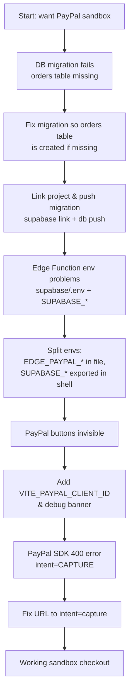

# PayPal Sandbox Troubleshooting Journey

This doc summarizes the main problems we hit while integrating PayPal **sandbox** into the food shop app, why they happened, and how we fixed them.

It is written in simple language so you can quickly remember what to check next time.

### Quick picture of the debugging journey



Follow the boxes from top to bottom to see the order in which we fixed things.

---

## 1. Database migration error: `relation "public.orders" does not exist`

**Symptom**

When running:

```bash
supabase db reset --local
```

Supabase failed on the migration file that added `payment_reference`:

```sql
alter table public.orders
  add column if not exists payment_reference text;
```

Error:

> relation "public.orders" does not exist

**Why this happened**

- The migration tried to **modify** the `public.orders` table.
- But in the **local** database, that table had not been created yet.
- So Postgres complained that there is no such table.

**How we fixed it**

We changed the migration to:

```sql
create table if not exists public.orders (
  id uuid primary key default gen_random_uuid(),
  customer_id uuid,
  subtotal numeric(10,2) not null,
  service_fee numeric(10,2) not null,
  delivery_fee numeric(10,2) not null,
  total numeric(10,2) not null,
  payment_provider text,
  payment_status text,
  notes text,
  payment_reference text,
  created_at timestamptz default now()
);

alter table public.orders
  add column if not exists payment_reference text;
```

So now:

- **Local dev**: if `orders` is missing, it gets created with `payment_reference` already there.
- **Hosted project**: if `orders` already exists, only the `alter table` runs and adds `payment_reference` if missing.

Then we:

```bash
supabase db reset --local
```

This recreated the local DB and successfully applied all migrations.

We also ran:

```bash
supabase link --project-ref <project_ref>
supabase db push
```

This pushed the migration to the **hosted** Supabase project.

To verify, we used:

```sql
select column_name, data_type
from information_schema.columns
where table_schema = 'public' and table_name = 'orders'
order by ordinal_position;
```

and confirmed that `payment_reference` exists both locally and on the hosted DB.

**Lesson**: migrations must be written so they work for both "table already exists" **and** "table does not exist yet" (or you must guarantee the creation migration runs earlier).

---

## 2. `supabase db push` error: `Have you run supabase link?`

**Symptom**

Running:

```bash
supabase db push --linked
```

caused:

> Cannot find project ref. Have you run supabase link?

**Why this happened**

- The local project folder was **not linked** to any Supabase project yet.
- Supabase CLI had no stored **project ref** in `supabase/.temp/`.

**How we fixed it**

We linked the folder to the correct project:

```bash
supabase link --project-ref auhaffmzzppbftokdpix
```

(the `project-ref` came from the Supabase dashboard URL / settings)

Then we ran:

```bash
supabase db push
```

This successfully applied the migration to the hosted database.

**Lesson**: before `supabase db push`, always ensure the local folder is linked with `supabase link --project-ref ...`.

---

## 3. Edge Function env file issues (`supabase/.env`)

**Symptoms**

1. First attempt:

   ```bash
   supabase functions serve capture-paypal-order --env-file ./supabase/.env
   ```

   Error:

   > failed to open env file: open .../supabase/.env: no such file or directory

2. After creating `supabase/.env` with **all** keys including `SUPABASE_URL` and `SUPABASE_SERVICE_ROLE_KEY`:

   ```bash
   supabase functions serve capture-paypal-order --env-file ./supabase/.env
   ```

   Warning:

   > Env name cannot start with SUPABASE_, skipping: SUPABASE_URL
   > Env name cannot start with SUPABASE_, skipping: SUPABASE_SERVICE_ROLE_KEY

**Why this happened**

- Initially there was **no** `supabase/.env`, so the CLI could not load anything.
- After creating it, the CLI refused environment variable names starting with `SUPABASE_` when passed via `--env-file`.
- This meant the Edge Function would not see `SUPABASE_URL` or `SUPABASE_SERVICE_ROLE_KEY` and DB access would fail.

**How we fixed it**

We used a split strategy:

- Put **PayPal secrets** only in `supabase/.env`:

  ```env
  EDGE_PAYPAL_CLIENT_ID=...
  EDGE_PAYPAL_CLIENT_SECRET=...
  ```

- Export the Supabase variables **in the shell**, not in `supabase/.env`:

  ```bash
  export SUPABASE_URL=https://<project>.supabase.co
  export SUPABASE_SERVICE_ROLE_KEY=<service-role-key>
  ```

Then we ran:

```bash
supabase functions serve capture-paypal-order --env-file ./supabase/.env
```

Now:

- PayPal keys come from the env file.
- Supabase keys come from the shell environment.
- The function server starts cleanly and can talk to both PayPal and Supabase.

**Lesson**: `--env-file` cannot be used for variables starting with `SUPABASE_`. Those must come from the shell (or environment), while custom keys like `EDGE_PAYPAL_CLIENT_ID` can live in the file.

---

## 4. Frontend did not show PayPal buttons

**Symptom**

- In the UI, after selecting **PayPal** as payment method and clicking **Place order**, the order was saved to the DB, but **no PayPal popup** appeared.
- There was **no** PayPal button visible.

**Why this happened**

Two separate issues:

1. **Behavior design**

   - The code only triggered the PayPal popup from the **PayPal Smart Buttons** (provided by the JS SDK).
   - The normal **"Place order"** button always called `saveOrder(...)` and never talked to PayPal.
   - So when you clicked "Place order" with payment method = `paypal`, it still used the old non-PayPal flow.

2. **Missing frontend PayPal client ID**

   - We had `EDGE_PAYPAL_CLIENT_ID` in `supabase/.env` for the Edge Function.
   - But there was **no** `VITE_PAYPAL_CLIENT_ID` in the root `.env`.
   - In `CheckoutForm.jsx` we had:

     ```js
     const PAYPAL_CLIENT_ID = import.meta.env.VITE_PAYPAL_CLIENT_ID
     const PAYPAL_ENV_FLAG = String(import.meta.env.VITE_ENABLE_PAYPAL ?? '').toLowerCase() === 'true'

     const supabaseAvailable = isSupabaseEnabled()
     const paypalEnabled = PAYPAL_ENV_FLAG && Boolean(PAYPAL_CLIENT_ID) && supabaseAvailable
     const showPayPalButtons = paypalEnabled && formData.paymentMethod === 'paypal'
     ```

   - Because `VITE_PAYPAL_CLIENT_ID` was missing, `paypalEnabled` was false.
   - So the code never loaded the PayPal SDK script and never rendered the PayPal buttons.

**How we fixed it**

1. **Debugging UI + logs**

   We added a debug effect and banner:

   ```js
   useEffect(() => {
     console.log('PayPal debug flags', {
       PAYPAL_ENV_FLAG,
       hasPaypalClientId: Boolean(PAYPAL_CLIENT_ID),
       supabaseAvailable,
       paypalEnabled,
       showPayPalButtons,
     })
   }, [supabaseAvailable, paypalEnabled, showPayPalButtons])
   ```

   And under the payment method field:

   ```jsx
   {formData.paymentMethod === 'paypal' && !paypalEnabled && (
     <p className="status-banner error">
       PayPal is not available in this environment.
       {!PAYPAL_ENV_FLAG && ' Reason: VITE_ENABLE_PAYPAL is not set to "true".'}
       {PAYPAL_ENV_FLAG && !PAYPAL_CLIENT_ID && ' Reason: VITE_PAYPAL_CLIENT_ID is missing.'}
       {PAYPAL_ENV_FLAG && PAYPAL_CLIENT_ID && !supabaseAvailable &&
         ' Reason: Supabase is not enabled (check VITE_SUPABASE_URL and VITE_SUPABASE_ANON_KEY).'}
     </p>
   )}
   ```

   This immediately showed:

   > PayPal is not available in this environment. Reason: VITE_PAYPAL_CLIENT_ID is missing.

2. **Adding frontend env vars**

   We updated the root `.env` (not `supabase/.env`) with:

   ```env
   VITE_ENABLE_PAYPAL=true
   VITE_PAYPAL_CLIENT_ID=<sandbox-client-id-from-paypal>
   ```

   Then restarted Vite:

   ```bash
   npm run dev
   ```

   After a hard refresh, the banner disappeared and PayPal buttons started to render (after fixing one more bug, see next section).

3. **Preventing the normal submit from bypassing PayPal**

   To avoid confusion when PayPal is selected, we:

   - Hid the normal submit button when PayPal buttons are active:

     ```jsx
     {(!showPayPalButtons || formData.paymentMethod !== 'paypal') && (
       <button type="submit" className="primary" disabled={!canSubmit || orderState.sending}>
         {orderState.sending ? 'Sending…' : 'Place order'}
       </button>
     )}
     ```

   - And in `handleSubmit`, we added a guard:

     ```js
     if (showPayPalButtons && formData.paymentMethod === 'paypal') {
       setOrderState((prev) => ({
         ...prev,
         error: 'To pay with PayPal, please use the PayPal buttons instead of the "Place order" button.',
       }))
       return
     }
     ```

   This makes it clear that PayPal flow must go through the PayPal buttons.

**Lesson**: PayPal needs **two** client IDs: one for the browser (Vite `VITE_` env) and one for the Edge Function. Also, make sure the UI prevents users from accidentally skipping the PayPal popup.

---

## 5. PayPal SDK 400 error: `Invalid query value for intent: CAPTURE`

**Symptom**

After adding `VITE_PAYPAL_CLIENT_ID`, the browser network log showed:

```text
GET https://www.paypal.com/sdk/js?client-id=...&currency=EUR&intent=CAPTURE 400 (Bad Request)
```

And opening that URL returned:

```js
throw new Error("SDK Validation error: 'Invalid query value for intent: CAPTURE'");

/* Original Error:

Invalid query value for intent: CAPTURE (debug id: ...)

*/
```

**Why this happened**

In `CheckoutForm.jsx` we loaded the PayPal JS SDK with:

```js
script.src = `https://www.paypal.com/sdk/js?client-id=${PAYPAL_CLIENT_ID}&currency=EUR&intent=CAPTURE`
```

But the PayPal SDK expects `intent=capture` **in lowercase**. Using uppercase `CAPTURE` made the SDK reject the parameters with a 400.

**How we fixed it**

We changed the script URL to use lowercase:

```js
const script = document.createElement('script')
// PayPal SDK expects lowercase `intent=capture` (uppercase CAPTURE causes a 400 SDK validation error).
script.src = `https://www.paypal.com/sdk/js?client-id=${PAYPAL_CLIENT_ID}&currency=EUR&intent=capture`
```

After restarting Vite and refreshing the page, the PayPal SDK loaded successfully, and the buttons appeared.

**Lesson**: Pay attention to exact parameter values in third-party URLs. Here the case of `capture` vs `CAPTURE` mattered.

---

## 6. Confirming the sandbox mode and no real payments

**Symptom / question**

- The PayPal popup showed a real-looking checkout asking to pay e.g. `15 €`.
- It was not obvious from the UI that this was a **sandbox** environment.

**Why this is safe**

- The popup URL was on `https://www.sandbox.paypal.com/...` and contained `env=sandbox`.
- The client ID we used came from **Sandbox → REST API apps** in the PayPal developer dashboard.
- We logged in with a **sandbox buyer account**, not a real PayPal account.

This means:

- All transactions are stored only in PayPal's **sandbox** system.
- No real bank or real PayPal balance is touched.

You can confirm by:

- Checking **Sandbox → Accounts → [buyer] → Activity** in the PayPal developer dashboard.
- Verifying that no such payments appear in your real PayPal account.

**Lesson**: the sandbox UI looks very close to production, but the key indicators are:

- URL host: `sandbox.paypal.com`
- `env=sandbox` parameter
- Use of sandbox credentials and sandbox client ID.

---

## 7. Final state

At the end of this journey, we had:

- A working `capture-paypal-order` Edge Function that:
  - Uses **EDGE_PAYPAL_CLIENT_ID** and **EDGE_PAYPAL_CLIENT_SECRET** from `supabase/.env`.
  - Uses `SUPABASE_URL` and `SUPABASE_SERVICE_ROLE_KEY` from the shell.
  - Captures PayPal orders and writes them to Supabase with `payment_provider = 'paypal'` and `payment_reference` set to the PayPal order ID.

- A `CheckoutForm` that:
  - Loads the PayPal JS SDK when `VITE_ENABLE_PAYPAL=true` and `VITE_PAYPAL_CLIENT_ID` is set.
  - Shows PayPal Smart Buttons when PayPal is selected.
  - Forces PayPal flow through the PayPal buttons, not the generic submit.
  - Falls back to the normal `saveOrder` flow for other payment methods.

- Migrations applied both locally and on the hosted Supabase project, with `payment_reference` available in `public.orders`.

This doc should help you remember the common pitfalls around:

- Supabase migrations
- Supabase CLI linking and env
- Edge Function env handling (`SUPABASE_` vs custom keys)
- Vite env vars vs server env vars
- PayPal SDK URL parameters and sandbox behavior
